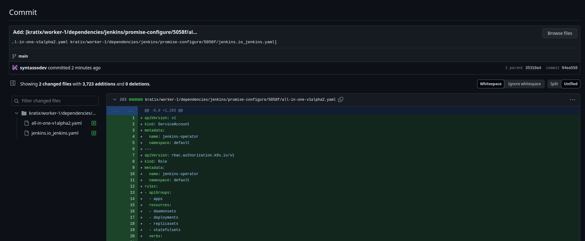
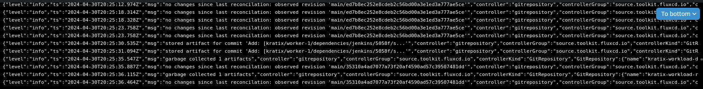
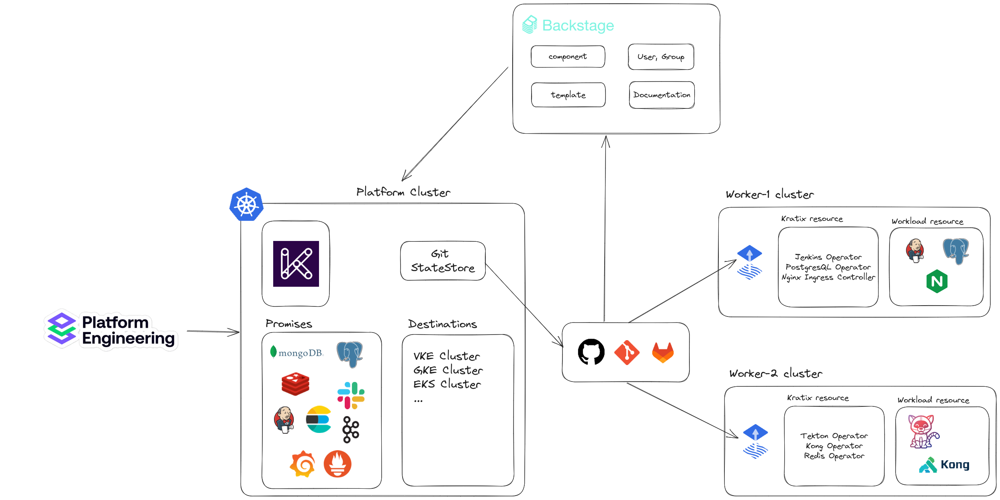

# Setup Kratix multi cluster deployment
This document describes how to setup a multi cluster deployment using Kratix.

## Set up platform cluster
1. Create a kind cluster using the provided configuration file.
    ```bash
    kind create cluster --config kind-platform-config.yaml
    ```
2. Install Cert Manager
    ```bash
    kubectl apply -f cert-manager.yaml
    ```
3. Install Kratix
    ```bash
    kubectl apply -f kratix.yaml
    ```
4. Create GitOps repository and create Git StateStore
    ```bash
    kubectl apply -f github-secret.yaml
    kubectl apply -f platform_v1alpha1_gitstatesstore.yaml
    ```
## Set up worker cluster
1. Create a kind cluster using the provided configuration file.
    ```bash
    kind create cluster --config kind-worker-config.yaml
    ```
2. Install Flux
    ```bash
    kubectl apply -f flux.yaml
    ```
3. Add repository to Flux
    ```bash
    kubectl apply -f github-secret.yaml
    kubectl apply -f gitops-tk-resource-git.yaml
    ```
## Register cluster as a Destination with Kratix
1. On platform cluster, create a Destination
    ```bash
    kubectl apply -f platform_v1alpha1_worker.yaml
    ```
    Flux will eventually reconcile the clusters state, making the worker cluster ready to receive workloads. You can verify its readiness by observing the kratix-worker-system namespace appearing in the worker cluster

# Deploy Jenkins Promise
1. Create a Jenkins Promise
    ```bash
    kubectl apply -f promise/jenkins/promise.yaml
    ```
2. New commit to the GitOps repository will trigger the deployment of Jenkins Promise on the worker cluster.
    
    

# Create platform cluster service account token
```bash
kubectl -n kube-system create serviceaccount kratix-sa
kubectl create clusterrolebinding kratix-cluster-admin --clusterrole=cluster-admin --serviceaccount=kube-system:kratix-sa
```

