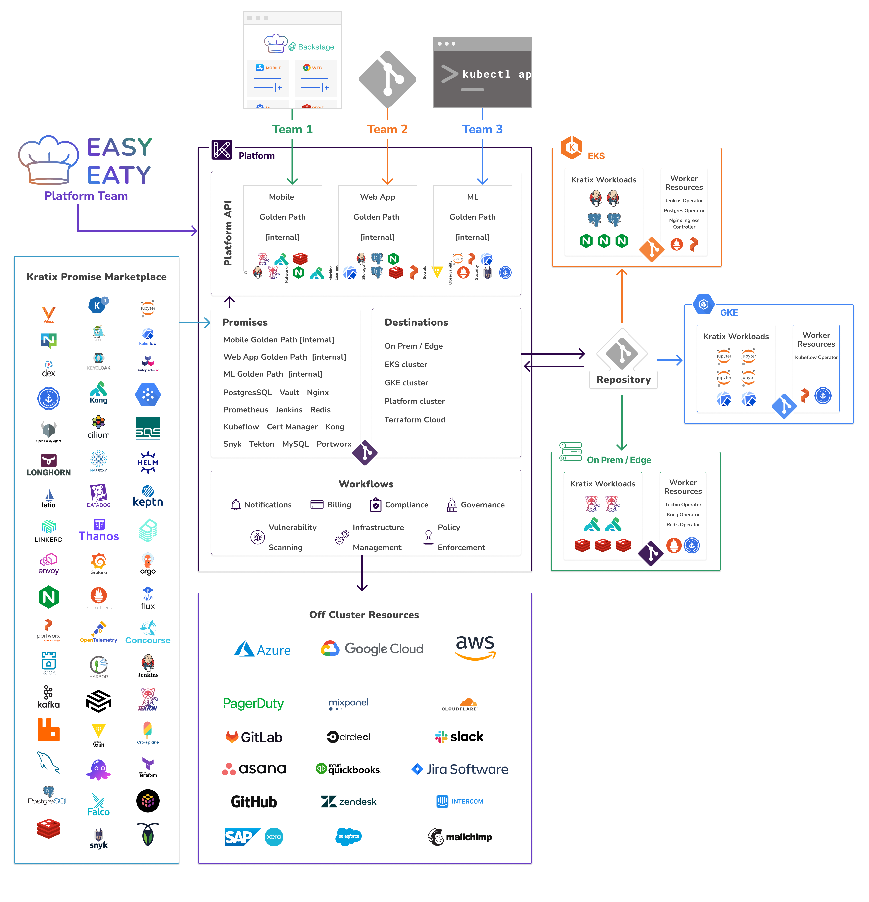

# Setup Kratix multi cluster deployment
This document describes how to setup a multi cluster deployment using Kratix.

## Set up platform cluster
1. Create a kind cluster using the provided configuration file.
    ```bash
    kind create cluster --config kind-platform-config.yaml
    ```
2. Install Cert Manager
    ```bash
    kubectl apply -f cert-manager.yaml
    ```
3. Install Kratix
    ```bash
    kubectl apply -f kratix.yaml
    ```

